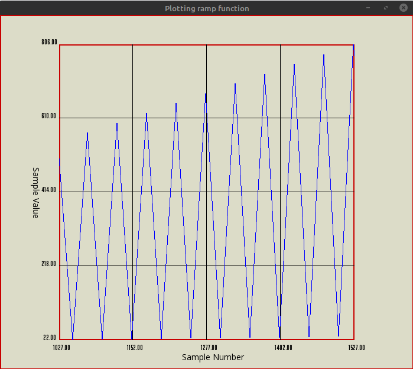

# Introduction
Plotter produces a real time graph of the values provided through various sources such as Files, comport etc. Plotter also lets you to also define your source by deriving from the interface "Input".

Plotter is written in C++17 and uses SFML to produce the graphics. Cmake is used to manage the build process.

# Minimum Requirements

* C++17
* Cmake version 3.10

# Overview of Plotter

The Plotter consists of 2 threads:

* Read the input from the source and store in the buffer
* Take the value from the buffer and plot

